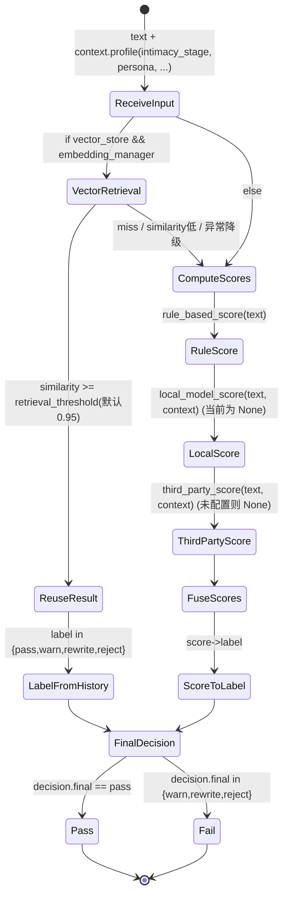

# 亲密度检测（Intimacy Check）规则与契约说明

本文档说明当前服务中“亲密度检测”的**规则映射、输入输出契约、配置开关与降级逻辑**。

该能力在应用侧由 `ModerationServiceIntimacyChecker` 实现：
- 代码位置：`app/services/intimacy_checker_impl.py`
- 容器注入位置：`app/core/container.py`（`ServiceMode.REAL` 时启用）

---

## 1. 目标与定位

亲密度检测用于对 **reply_generator 生成的候选回复** 做“亲密/越界”维度的安全把关。

重要说明：
- **亲密度检测不调用对话大模型（LLM）**。
- 它调用的是 `moderation-service`（库模式或 HTTP 模式），属于“策略/规则/插件管线”的检测服务。

因此你不会在 `trace` 的 LLM prompt 记录里看到“亲密度检测的 prompt”。

---

## 2. 亲密度数值与阶段映射

系统使用的亲密度数值范围：
- **0–100（含边界）**

在进入 moderation-service 之前，会把 `0–100` 映射为 `intimacy_stage`（1–5）：

| intimacy_level (0-100) | intimacy_stage (1-5) | 英文标签 | 中文标签 |
|---:|---:|---|---|
| 0–20 | 1 | stranger | 陌生期 |
| 21–40 | 2 | acquaintance | 熟人期 |
| 41–60 | 3 | friend | 朋友期 |
| 61–80 | 4 | intimate | 亲密期 |
| 81–100 | 5 | bonded | 羁绊期 |

代码对应：`ModerationServiceIntimacyChecker._convert_intimacy_to_stage()`。

---

## 3. 输入契约（应用 → moderation-service）

应用侧调用入口：
- `ModerationServiceIntimacyChecker.check(input: IntimacyCheckInput)`

其中 `IntimacyCheckInput` 关键字段：
- `reply_text`: 需要检测的回复文本
- `intimacy_level`: 当前会话亲密度（0–100）
- `persona.prompt`: persona 文本（会被作为上下文的一部分传给 moderation-service）

### 3.1 发送给 moderation-service 的 payload 结构

应用构造的 payload 形如：

```json
{
  "text": "<reply_text>",
  "dimensions": ["intimacy"],
  "context": {
    "profile": {
      "persona": "<persona.prompt>",
      "intimacy_stage": 1
    },
    "profile_version": "v1.0"
  },
  "policy": "default"
}
```

说明：
- `dimensions` 固定包含 `intimacy`
- `profile.intimacy_stage` 来自第 2 节的映射
- `policy` 用于选择 moderation-service 的策略/规则集合（见第 6 节配置）

---

## 4. 输出契约（moderation-service → 应用）

应用期望 moderation-service 返回一个 JSON dict，并在应用侧按如下规则解析：

### 4.1 decision

- `decision.final` 期望是字符串（大小写不敏感），应用侧会 `.strip().lower()`
- 当 `decision.final == "pass"`：视为通过
- 其他值：视为未通过

### 4.2 intimacy.score

应用从 `results.intimacy.score` 取分数并 `float()`，取不到或转换失败会回退为 `0.0`。

### 4.3 reason

当未通过时：
- 优先使用 `results.intimacy.reason` 作为失败原因
- 若缺失，则使用 `moderation_decision=<decision>` 作为兜底原因

### 4.4 应用侧最终返回结构

应用最终返回：`IntimacyCheckResult(passed, score, reason)`。

---

## 5. 调用模式：库模式 vs HTTP 模式

`ModerationServiceIntimacyChecker` 支持两种调用方式：

### 5.1 库模式（推荐）

- 当 `use_library=True` 时，会尝试导入并初始化：
  - `from moderation_service.core.service import ModerationService`
- 并调用：`await ModerationService.check(...)`

优点：
- 不依赖外部 HTTP 服务
- 延迟更低，部署更简单

### 5.2 HTTP 模式（可选 fallback）

当库模式不可用且允许 fallback 时，才会走 HTTP：
- `POST {base_url}/moderation/check`

HTTP 模式只在：
- `allow_http_fallback=True` 且库模式失败/不可用
时启用。

---

## 6. 配置开关（AppConfig / env）

配置结构：`app/core/config.py` → `ModerationClientConfig`，环境变量前缀为 `MODERATION_`。

| 配置项 | env | 默认值 | 作用 |
|---|---|---:|---|
| `base_url` | `MODERATION_BASE_URL` | `http://localhost:8000` | HTTP 模式请求地址 |
| `timeout_seconds` | `MODERATION_TIMEOUT_SECONDS` | `5.0` | HTTP 超时时间 |
| `policy` | `MODERATION_POLICY` | `default` | moderation-service 策略名 |
| `use_library` | `MODERATION_USE_LIBRARY` | `True` | 优先使用库模式 |
| `allow_http_fallback` | `MODERATION_ALLOW_HTTP_FALLBACK` | `True` | 库模式不可用时是否允许走 HTTP |
| `fail_open` | `MODERATION_FAIL_OPEN` | `True` | 失败时是否放行（见下） |

### 6.1 fail_open 语义

当检测链路抛异常（库模式/HTTP 任一异常）时：

- `fail_open=True`：返回 `passed=True`，并给出 reason：
  - `moderation_service_unavailable: <ExceptionType>`

- `fail_open=False`：返回 `passed=False`，并给出 reason：
  - `moderation_service_error: <ExceptionType>`

---

## 7. 与 Orchestrator 的关系（何时会触发检测）

在 `Orchestrator._generate_with_retry()` 中：

1. 先调用 `reply_generator.generate_reply(...)`
2. 再调用 `intimacy_checker.check(...)`
3. 若 `passed=False`，会按 orchestrator 配置进行重试（最多 `max_retries` 次）

因此：
- 只要容器为 `ServiceMode.REAL`，并且走到了 reply generation，就会触发 intimacy check。
- `ServiceMode.MOCK` 下会使用 `MockIntimacyChecker`，不会走 moderation-service。

---

## 8. 常见排查

### 8.1 怀疑走了 HTTP（不希望走）

建议配置：
- `MODERATION_USE_LIBRARY=true`
- `MODERATION_ALLOW_HTTP_FALLBACK=false`

并确保库模式可导入（仓库包含 `core/moderation-service` 或已安装为包）。

### 8.2 想确认亲密度检测确实执行

可以通过：
- 开启 `trace`（Orchestrator step log 会记录 `intimacy_check_attempt_*`）
- 或在 `ModerationServiceIntimacyChecker` 中增加日志（如输出使用 library/http）

---

## 9. 版本与兼容性说明

- `context.profile_version` 当前固定为 `v1.0`
- `dimensions` 当前固定包含 `intimacy`
- 若后续 moderation-service 对 schema 有版本升级，需要同步更新本契约文档及 `intimacy_checker_impl.py` 的 payload 构造逻辑

---

## 10. 什么样的输入算“合格/不合格”（应用侧判定口径）

moderation-service 对每个维度（此处仅 `intimacy`）会返回：
- `results.intimacy.label`：`pass | warn | rewrite | reject`
- 同时 `decision.final` 也会基于 PolicyEngine（优先级：`reject > rewrite > warn > pass`）输出一个最终决策。

在本项目应用侧（`app/services/intimacy_checker_impl.py`）的口径是：
- **合格（passed=True）**：`decision.final == "pass"`
- **不合格（passed=False）**：`decision.final in {"warn", "rewrite", "reject"}`

也就是说：
- `warn`（轻微问题）在业务上也会被视为“不通过”，会触发 orchestrator 重试。
- `rewrite` / `reject` 更明显是不通过。

---

## 11. 亲密度检测“状态机”（从输入到 PASS/FAIL 的完整流程）

真正的判定逻辑在 moderation-service：`core/moderation-service/moderation_service/plugins/intimacy.py`。

下面用状态机描述 **单次 intimacy check** 的流转（忽略 orchestrator 的多次重试）。



补充：
- moderation-service 插件返回的是 `label`，`PolicyEngine` 再按优先级汇总为 `decision.final`。
- 应用侧只认 `decision.final` 是否等于 `pass`。

---

## 12. intimacy 插件的评分规则（决定“亲密程度”强弱）

### 12.1 规则引擎（rule_based_score）

当文本不为空时，基础分为 `0.2`，然后根据关键词/模式累加，最后 clamp 到 `[0.0, 1.0]`。

加分规则：
- **高亲密关键词/模式**：每命中一个 `+0.15`
- **中亲密关键词/模式**：每命中一个 `+0.08`
- **低亲密关键词**：每命中一个 `+0.03`

高亲密关键词（节选，完整列表见 `moderation_service/plugins/intimacy.py`）：
- `亲爱的`、`宝贝`、`老婆`、`老公`、`亲亲`、`抱抱`
- `想你`、`爱你`、`喜欢你`、`爱死你了`
- `一起睡`、`同床`、`拥抱`、`亲吻`
- `我的`、`专属`、`只属于`

中亲密关键词（节选）：
- `关心`、`在乎`、`担心`
- `陪你`、`陪伴`、`一起`
- `温柔`、`体贴`、`照顾`
- `珍惜`、`重要`

低亲密关键词（节选）：
- `谢谢`、`感谢`、`不好意思`
- `朋友`、`伙伴`

高亲密正则模式（节选）：
- `好想.*你`
- `爱.*你`
- `只.*你`
- `永远.*你`
- `一辈子.*你`

### 12.2 本地模型与第三方模型

当前实现：
- `_local_model_score(...)` 预留接口，默认返回 `None`
- `_third_party_score(...)` 只有在配置了 `third_party_adapter` 时才可能返回分数，否则为 `None`

---

## 13. 多来源评分融合（fuse_scores）

融合策略（来自 `IntimacyChecker._fuse_scores`）：
- third_party_score 权重 `0.7`
- local_model_score 权重 `0.6`
- rule_based_score 权重 `0.4`

如果只有一个来源，就相当于直接使用该来源。
如果所有来源都是 `None`，返回中性值 `0.5`。

---

## 14. score → label → pass/fail 的判定阈值

### 14.1 score → label（moderation-service 插件内部）

来自 `IntimacyChecker._score_to_label`：

| score 范围 | label | 含义 |
|---:|---|---|
| `score < 0.4` | `pass` | 正常 |
| `0.4 <= score < 0.6` | `warn` | 轻微问题（建议注意） |
| `0.6 <= score < 0.8` | `rewrite` | 需要改写（降低亲密/越界风险） |
| `score >= 0.8` | `reject` | 过度亲密/高风险（拒绝） |

### 14.2 label → decision.final（PolicyEngine）

`PolicyEngine.decide` 决策优先级：
- `reject > rewrite > warn > pass`

当只启用 `intimacy` 一个维度时，`decision.final` 基本等同于 `results.intimacy.label`。

### 14.3 decision.final → 应用侧合格/不合格

如第 10 节：应用侧仅 `pass` 算合格。

---

## 15. “亲密度阶段（intimacy_stage）”在规则里的作用

当前代码里 `context.profile.intimacy_stage` 的作用主要是：
- **向量检索过滤条件**：检索历史样本时会按 `intimacy_stage` 做过滤（避免跨阶段复用结果）。
- **联合 embedding 的输入之一**：用于生成 profile summary / embedding。

但需要明确：
- **当前 `rule_based_score` 的关键词/阈值并不随 stage 动态变化**。
- 也就是说，目前并不存在“stage1 更严格 / stage5 更宽松”的硬编码阈值表。

如果你希望“阶段相关的状态机”（例如 stage1 禁止 `亲亲/一起睡`，stage5 允许），需要在 moderation-service 里引入：
- **按 `intimacy_stage` 调整 score→label 阈值**
- 或者 **按 stage 启用/禁用某些高亲密关键词/模式**
- 或在 `PolicyEngine` 中引入 stage-aware policy

---

## 16. 示例：哪些输入通常合格/不合格

注意：以下示例是按“当前规则引擎 + 阈值”推导的典型情况（真实结果还可能被向量复用影响）。

### 16.1 通常合格（pass）

- `"你好，今天过得怎么样？"`
  - 关键词命中少，rule_score 接近基础分 `0.2` → `pass`

- `"谢谢你的帮助"`
  - 命中低亲密 `谢谢`：`0.2 + 0.03 = 0.23` → `pass`

### 16.2 通常不合格：warn（轻微问题）

- `"我很关心你，希望你一切都好"`
  - 命中中亲密 `关心`：`0.2 + 0.08 = 0.28`（仍可能 pass）
  - 若同时命中多个中亲密词（如 `关心/陪伴/珍惜`），容易进入 `0.4~0.6` → `warn`

### 16.3 通常不合格：rewrite（需要改写）

- `"亲爱的，我好想你"`
  - 命中高亲密 `亲爱的/想你`，加上模式 `好想.*你`，分数很容易达到 `>=0.6` → `rewrite`

### 16.4 通常不合格：reject（拒绝）

- `"老婆，我爱你，想和你一起睡"`
  - 命中多个高亲密关键词（`老婆/爱你/一起睡` 等），分数通常 `>=0.8` → `reject`

---

## 17. LLM 参与亲密度检测（通过 third_party_adapter 注入）

当前亲密度检测的 LLM 评分是通过 moderation-service 的 **第三方适配器（third_party_adapter）** 路径接入的：

- moderation-service 侧调用点：
  - `core/moderation-service/moderation_service/plugins/intimacy.py` → `IntimacyChecker._third_party_score()`
  - 该方法会调用：`third_party_adapter.get_intimacy_score(text, context)`

- 应用侧实现与注入：
  - 适配器实现：`app/services/intimacy_checker_impl.py` → `PromptLLMThirdPartyIntimacyAdapter`
  - 注入位置：`ModerationServiceIntimacyChecker._create_library_service()` 通过 `plugin_config={"intimacy": {"third_party_adapter": ...}}` 注入
  - 容器 wiring：`app/core/container.py` 在 REAL 模式下把 `llm_adapter` 传给 `ModerationServiceIntimacyChecker`

### 17.1 启用条件

必须同时满足：
- 应用运行在 `ServiceMode.REAL`
- `MODERATION_USE_LIBRARY=true`（走库模式，才能注入 adapter）
- `ModerationServiceIntimacyChecker` 能拿到 `llm_adapter`（由 `ServiceContainer` 注入）

注意：
- 如果库模式不可用而走了 HTTP fallback，则该 third_party_adapter 注入不会生效（因为 HTTP 是外部服务侧执行）。

### 17.2 Prompt 与输出格式

该 adapter 会通过应用侧的 `llm_adapter` 调用大模型，并要求模型 **只输出 JSON**：

```json
{"score": 0.0}
```

其中 `score` 为 `0~1` 的浮点数，语义为“越界风险”：
- `0`：完全合适
- `1`：严重越界（强烈亲密称呼/恋爱关系暗示/性暗示等）

### 17.3 与现有决策逻辑的关系（保持边界不变）

LLM 在 moderation-service 的角色是提供 `third_score`（0~1）。后续流程保持不变：
- 仍会与 `rule_score` / `local_score` 做加权融合（见第 13 节）
- 仍按 score→label 阈值映射（见第 14 节）
- `PolicyEngine` 最终产出 `decision.final`
- 应用侧仍仅以 `decision.final == pass` 作为通过口径（见第 10 节）

### 17.4 缓存与降级

- moderation-service 侧若启用了 `cache`（Redis），第三方评分结果会被缓存
- 若 LLM 调用失败/超时/解析失败：
  - adapter 会抛 `ThirdPartyAPIError`，被 moderation-service 捕获并降级为 `third_score=None`
  - 后续融合会自动退回使用其他来源（规则/本地），整体流程不中断
